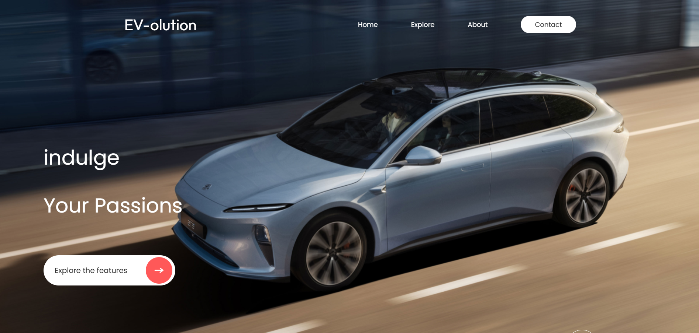

# ⚡ EV-olution - Electric Vehicle Landing Page

**EV-olution** is a sleek, modern, and fully responsive electric vehicle website landing page built with **ReactJS**. Perfect for showcasing front-end skills, product design layouts, and mobile responsiveness.

## 🚀 Live Demo

👉 [Live App](https://github.com/muhdzaheermv/restaurent-react-website)

## 🛠️ Tech Stack

- **ReactJS**
- **JavaScript (ES6+)**
- **CSS3**
- **Responsive Design Techniques**

## ✨ Features

- Full landing page with modern EV theme
- Fully responsive for all devices
- Reusable React components
- Smooth scrolling and section transitions
- Clean UI/UX

## 📚 Ideal For

- Front-End Portfolio Showcase
- ReactJS Developers
- Product/Brand Landing Pages
- Responsive Web Design Practice

## 📫 Contact Me

- **📧 Email:** muhdzaheermv@gmail.com  
- **🔗 Portfolio:** [https://portfolio-lilac-eight-60.vercel.app/](https://portfolio-lilac-eight-60.vercel.app/)  
- **💼 LinkedIn:** [https://www.linkedin.com/in/muhammed-zaheer-836132244/](https://www.linkedin.com/in/muhammed-zaheer-836132244/)

## ⭐ Like This Project?

If you enjoyed this landing page or found it inspiring, don’t forget to **⭐ star** this repository — your support means a lot and keeps me building!

